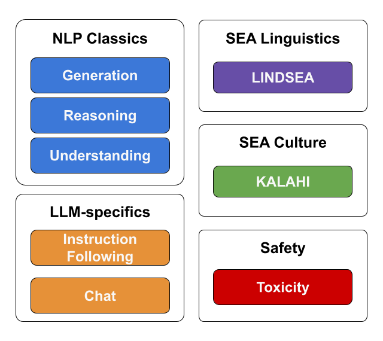

# SEA-HELM (SouthEast Asian Holistic Evaluation of Language Models)

[](https://arxiv.org/abs/2502.14301)

> [!NOTE]  
> BHASA has been integrated into SEA-HELM

## Overview
SEA-HELM (SouthEast Asian Holistic Evaluation of Language Models) is an assessment of large language models (LLMs) across various tasks, emphasizing Southeast Asian languages. This suite consist of 5 core pillars - NLP Classics, LLM-specifics, SEA Linguistics, SEA Culture and Safety - which evaluates the performance of LLMs across a range of key capabilities in the SEA languages.



Results from SEA-HELM can be found on the SEA-HELM leaderboard at [https://leaderboard.sea-lion.ai/](https://leaderboard.sea-lion.ai/).

## Evaluating Models using SEA-HELM

### Setup environment for SEA-HELM
1. Install the virtual environment using `requirements.txt`
2. Ensure that the appropriate HF_TOKEN has been set in the environment (with access to gated models).

> [!NOTE]  
> **Running LLM-as-a-Judge for MT-bench**  
> SEA-HELM currently uses `gpt-4-1106-preview` as the Judge LLM. As such, there is a need to access the OpenAI servers. Please ensure that `OPENAI_API_KEY` environment variable is set.
>
> ```
> export OPENAI_API_KEY=...
> ```

> [!NOTE]  
> **Translation evaluation using deep learning based models**  
> To run the evaluation with MetricX models please ensure that you have access to the following MetricX models on Huggingface.
> - MetricX-24 (XXL, bfloat16): https://huggingface.co/google/metricx-24-hybrid-xxl-v2p6-bfloat16


### Instructions for running SEA-HELM
<details open>

<summary><strong>Option 1: Running SEA-HELM using vLLM from the CLI</strong></summary>

SEA-HELM can be run using the following bash command by replacing
1. `<model_name>` with the desired huggingface model id or a local folder containing a huggingface model
1. `<output_dir>` with the local folder to save the run config and results

The command will run inference on the desired model with vLLM using a single gpu.
> ```bash
> python seahelm_evaluation.py --tasks seahelm --output_dir <output_dir> --model_type vllm --model_name <model_name> --model_args "dtype=bfloat16,enable_prefix_caching=True,tensor_parallel_size=1"
> ```
</details>

> [!TIP]  
> `--model_args` takes any kwargs specified in [https://docs.vllm.ai/en/latest/serving/engine_args.html](https://docs.vllm.ai/en/latest/serving/engine_args.html) and allows for control of how vLLM serves the model

<details>

<summary><strong>Option 2: Running using the provided bash script</strong></summary>

To run the evaluation:
1. Specify the path to the output directory (for the model generations, results JSON and log files) as well as the models to be evaluated in `run_evaluation.sh`
1. Then run the evaluation with the following command:

```bash
bash run_evaluation.sh
```

This sets up a screen screen running the SEA-HELM evaluation python script
</details>

> [!TIP]  
> You may use `screen -R {SESSION_NAME}` to attach to the screen running the evaluation to view the progress (session name will be printed out when the script is run).

### Important notes about running SEA-HELM
  
1. Please ensure that the `--base_model` flag is included if the model to be evaluated is a base model. This will load a default base model chat template (see `chat_templates\base_model.jinja`). The `--base_model` will also disable the MT-Bench tasks.
1. All inference results are cached in the results folder to allow for resumption of incomplete runs. If there is a need to rerun the inference, please either delete the corresponding model folder in the results folder or set the flag `--rerun_cached_results`
1. LLM-as-a-Judge in SEA-MT-Bench
    1. The OpenAI calls are currently performed using the OpenAI's Batch API to save cost. This might result in a small increase in the wait times depending on the load of the OpenAI servers.
    1. If present as a task to run, MT-Bench is run as the first task so as to allow for the judgements to be done while the rest of the evaluations are being done.

***

## Links to find out more
* For the details on how to customize the evaluation run using the command line, please refer to [Command Line Interface](docs/cli.md).
* For the evaluation datasets used, please refer to [Datasets and Prompts](docs/datasets_and_prompts.md).
* For details on the score normalisation and aggregation process, please refer to [Score Calculations](docs/score_calculations.md).
* For details on the folder structure of this repo, please refer to [Folder Structure](docs/seahelm_folder_structure.md).
* For details on how to add a new task, please refer to [New Task Guide](docs/new_task_guide.md).
* For details on the model serving frameworks, please refer to [Model Serving](docs/serving_models.md)

## Other References
1. Leong, W. Q., Ngui, J. G., Susanto, Y., Rengarajan, H., Sarveswaran, K., & Tjhi, W. C. (2023). Bhasa: A holistic southeast asian linguistic and cultural evaluation suite for large language models. arXiv preprint [arXiv:2309.06085](https://arxiv.org/abs/2309.06085).
    - Code: [https://github.com/aisingapore/BHASA](https://github.com/aisingapore/BHASA)

## License
The codes for SEA-HELM is licensed under the MIT license. All datasets are licensed under their respective licenses. Please see [Datasets and Prompts](docs/datasets_and_prompts.md) for the full list of licenses.

## Citation
If you use this software in your research, please cite the [SEA-HELM](https://arxiv.org/abs/2502.14301) paper as below.
```
@misc{susanto2025seahelmsoutheastasianholistic,
      title={SEA-HELM: Southeast Asian Holistic Evaluation of Language Models}, 
      author={Yosephine Susanto and Adithya Venkatadri Hulagadri and Jann Railey Montalan and Jian Gang Ngui and Xian Bin Yong and Weiqi Leong and Hamsawardhini Rengarajan and Peerat Limkonchotiwat and Yifan Mai and William Chandra Tjhi},
      year={2025},
      eprint={2502.14301},
      archivePrefix={arXiv},
      primaryClass={cs.CL},
      url={https://arxiv.org/abs/2502.14301}, 
}
```
